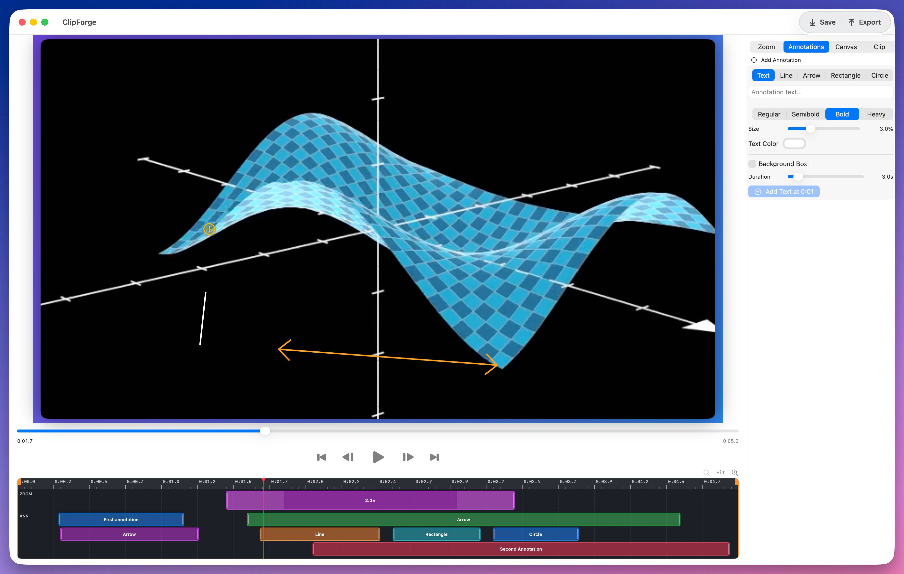

# ClipForge

Video editor for iOS and macOS with timeline-based zoom, annotations, canvas styling, clip trim/speed controls, and baked export via AVFoundation.



## Highlights

- Import videos from Files (iOS + macOS) and Photos (iOS)
- Real-time preview with AVPlayer
- Visual timeline drag editing for zoom and annotation segments
- Zoom controls: start/end timing, duration, easing, enable/disable
- Annotation controls: text, line, rectangle, and circle overlays
- Clip controls: trim in/out and playback speed from `0.25x` to `4.0x`
- Canvas/background controls: gradient, solid, or none, with presets and style tuning
- Export `.mp4` with baked zoom ramps, annotations, and canvas styling

## Platforms

- iOS 17+
- macOS 14+
- Swift tools: 5.9 (`Package.swift`)

## Building & Installing

To build and install ClipForge on macOS:

```bash
./install.command [--open]
```

**Flags:**
- `--open`: Automatically launch the installed app after build (optional)

This script compiles the Xcode project and installs the resulting `.app` bundle to your `~/Applications` folder.

## Tech Stack

- SwiftUI for UI
- AVFoundation for playback/composition/export
- Core Animation (`CALayer`, `CATextLayer`, `CAShapeLayer`) for overlay rendering
- No third-party dependencies

## License

This project is licensed under the MIT License.

See `LICENSE` for the full text.
